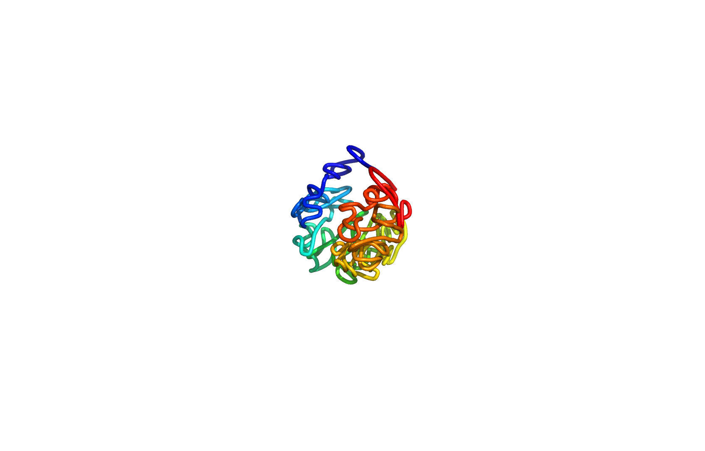
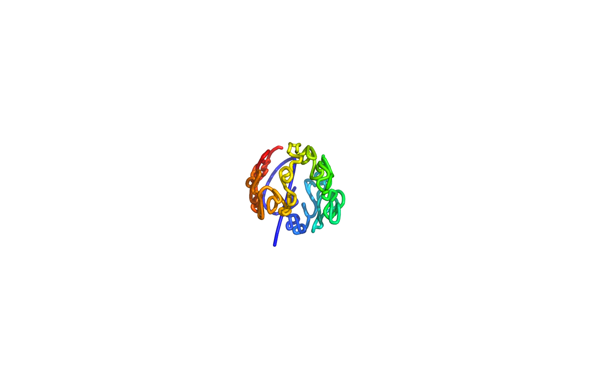
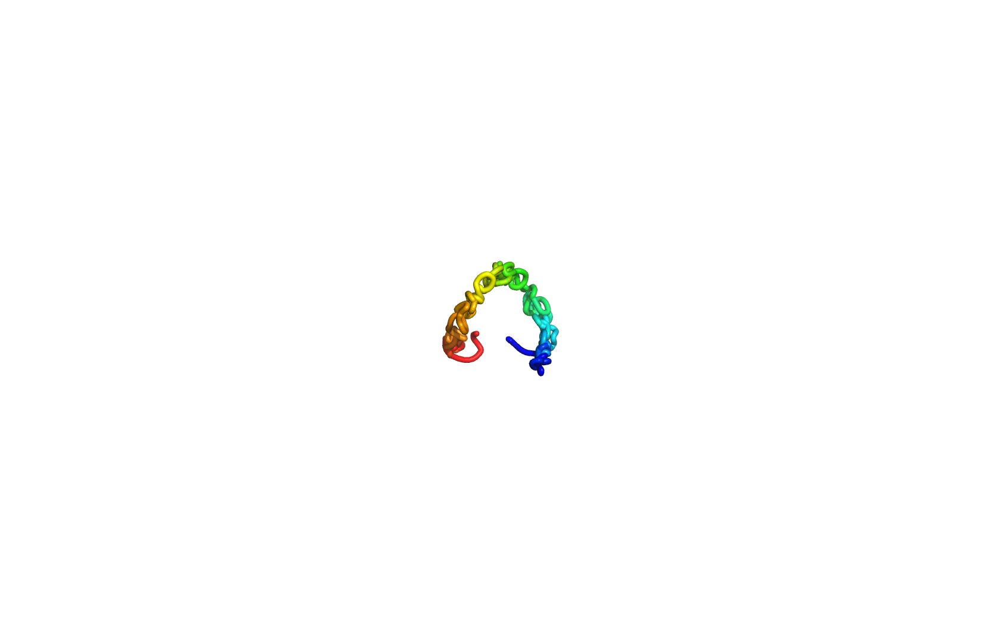

# 3D Chromosome Structure Reconstruction from Hi-C Data

This project demonstrates a complete bioinformatics pipeline for reconstructing the 3D structure of human chromosome X using Hi-C sequencing data. The implementation includes data processing from raw sequencing reads to 3D visualization, featuring multiple approaches to multidimensional scaling (MDS).



## Project Overview

Hi-C (High-throughput Chromosome Conformation Capture) is a genomic technique that provides information about the three-dimensional organization of chromatin in a cell. This project implements a complete pipeline to:

1. Process paired-end sequencing reads and map them to a reference genome
2. Generate contact frequency matrices representing spatial relationships
3. Convert contact frequencies to distance metrics
4. Apply multidimensional scaling algorithms to reconstruct 3D coordinates
5. Visualize the resulting 3D chromosome structure

The implementation spans multiple programming languages (Python and Perl) and demonstrates skills in computational biology, statistics, and machine learning.

## Technical Background

### Hi-C Data and Chromatin Structure

Hi-C technology captures spatial proximity between genomic regions by cross-linking DNA segments that are physically close to each other in the nucleus. By sequencing these cross-linked fragments, we can infer which regions of the chromosome interact with each other, revealing the 3D architecture of the genome.

### Multidimensional Scaling (MDS)

MDS is a dimensionality reduction technique that takes a matrix of pairwise distances or dissimilarities between points and finds a configuration of points in a lower-dimensional space that preserves these distances as closely as possible. In this project, we use MDS to convert the inferred spatial distances between genomic segments into 3D coordinates.

This project includes:

- A custom implementation of classical MDS from scratch
- An implementation using scikit-learn's MDS algorithm

## Project Structure

```text
.
├── classical_mds.py              # Custom MDS implementation from scratch
├── coords_2_linear.pl            # Converts coordinates to PDB format
├── generate_contact_library.pl   # Processes paired-end reads to create contact library
├── generate_contact_map.pl       # Creates contact frequency matrix
├── generate_distance_map.pl      # Converts contact matrix to distance matrix
├── mds.py                        # scikit-learn based MDS implementation
├── HiC3D                         # Executable for 3D structure reconstruction
└── contact_library.txt           # Processed contact library from step 1
```

## Implementation Details

### Step 1: Creating a Hi-C Contact Library

The first phase of the pipeline processes paired-end reads from Hi-C sequencing to identify pairs of genomic regions that are spatially proximate:

```text
generate_contact_library.pl
```

This script:

- Parses SAM files containing mapped paired-end reads from Hi-C experiments
- Extracts read IDs and mapping coordinates
- Matches paired reads by their IDs
- Outputs a contact library with pairs of genomic coordinates that interact with each other

The implementation uses efficient hash structures to store and match read pairs, demonstrating skills in data structure optimization and biological sequence processing.

### Step 2: Generating Contact and Distance Matrices

```text
generate_contact_map.pl
generate_distance_map.pl
```

This phase involves:

1. Binning the genome at 1 Mb resolution (dividing the chromosome into 155 segments)
2. Creating a contact frequency matrix where each cell represents the number of interactions between two genomic regions
3. Removing rows/columns with all zeros, resulting in a 153x153 matrix
4. Converting contact frequencies to spatial distances using the formula: distance = (1/contact)^(1/3)

The implementation includes data validation, proper handling of edge cases (e.g., zero contact values), and ensures symmetry in the resulting matrices.

### Step 3: 3D Structure Reconstruction with MDS

The project includes two different implementations of multidimensional scaling:

```text
classical_mds.py  # Custom implementation from scratch
mds.py            # Implementation using scikit-learn
```

The custom implementation:

- Implements the complete classical MDS algorithm from scratch
- Includes double centering of the distance matrix
- Performs eigendecomposition to extract principal coordinates
- Handles non-Euclidean distance matrices with appropriate warnings

The scikit-learn implementation:

- Demonstrates skills in using machine learning libraries
- Provides a comparative approach to evaluate against the custom implementation

Both implementations output 3D coordinates for each genomic segment, which can be used for visualization.

### Step 4: Visualization Preparation

```text
coords_2_linear.pl
```

This script:

- Converts the MDS-derived 3D coordinates to PDB format
- Formats the output for visualization with PyMol
- Creates a 3D model where each point represents a 1 Mb segment of the X chromosome

## Results and Visualization

The project produces three different 3D visualizations of chromosome X structure using different MDS implementations:

1. **HiC3D Implementation (Most Accurate):**
   
   This visualization was generated using the C++ HiC3D executable, which produced the most accurate 3D reconstruction of the chromosome structure.

2. **Scikit-learn MDS Implementation:**
   
   This visualization used scikit-learn's MDS implementation, showing slight variations in the chromosome folding pattern compared to HiC3D.

3. **Custom Classical MDS Implementation:**
   
   This visualization was produced using our custom implementation of classical MDS from scratch, demonstrating a third perspective on the chromosome structure.

Each implementation reveals slightly different aspects of the chromosome's 3D architecture, with the HiC3D result considered the reference standard. The differences between these visualizations highlight the importance of algorithm selection in 3D genome reconstruction.

## Skills Demonstrated

This project showcases a variety of technical skills:

### Programming

- **Python**: Algorithm implementation, scientific computing, machine learning
- **Perl**: Text processing, data parsing, file manipulation

### Bioinformatics

- Genomic data processing
- Paired-end read analysis
- Chromosome structure modeling
- Visualization of biological structures

### Machine Learning and Statistics

- Custom implementation of dimensionality reduction algorithms
- Eigendecomposition and matrix operations
- Distance metric calculations and transformations

### Software Engineering

- Modular code organization
- Command-line argument parsing
- Error handling and validation
- File I/O operations

## References

This project was developed as part of a graduate-level bioinformatics course. The implementation follows standard approaches in 3D genome reconstruction using Hi-C data.

## Running the Code

This repository includes the necessary files to reproduce most of the pipeline locally:

### What you can run

1. You can process the included `contact_library.txt` using the Perl scripts to generate contact and distance matrices
2. You can run the MDS algorithms (both custom and scikit-learn implementations) to generate 3D coordinates
3. You can use the included `HiC3D` executable to perform the 3D structure reconstruction

### Prerequisites

- Python 3 with NumPy and scikit-learn installed
- Perl

### Example Workflow

```bash
# Generate contact matrix from provided contact library
perl generate_contact_map.pl contact_library.txt

# Generate distance matrix from contact matrix
perl generate_distance_map.pl

# Run custom MDS implementation
python classical_mds.py -d chrX_1Mb_distance_map.txt -o chrX_1Mb_coordinates.txt

# Run scikit-learn MDS implementation
python mds.py -d chrX_1Mb_distance_map.txt -o chrX_1Mb_coordinates2.txt

# Run HiC3D (alternative MDS implementation)
./HiC3D -d chrX_1Mb_distance_map.txt -o chrX_1Mb_coordinates3.txt

# Convert coordinates to PDB format
perl coords_2_linear.pl chrX_1Mb_coordinates.txt chrX_1Mb_coordinates.pdb
```

Note: The final visualization step requires PyMol, which is not included in this repository. However, the generated PDB files can be visualized with any molecular visualization software that supports the PDB format.
